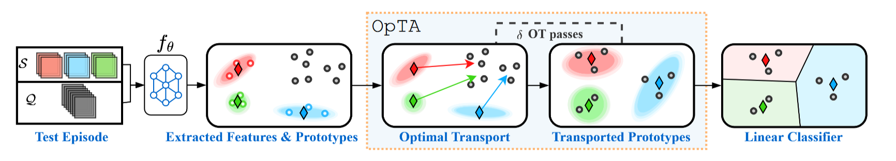

# Codebase of BECLR
### Official PyTorch Implementation for ["BECLR: Batch Enhanced Contrastive Unsupervised Few-Shot Learning"](https://openreview.net/forum?id=k9SVcrmXL8)<br> (Stylianos Poulakakis-Daktylidis, Hadi Jamali-Rad)
* Accepted for **Spotlight** Presentation in ICLR 2024 
## Abstract
Learning quickly from very few labeled samples is a fundamental attribute that separates machines and humans in the era of deep representation learning. Unsupervised few-shot learning (U-FSL) aspires to bridge this gap by discarding the reliance on annotations at training time. Intrigued by the success of contrastive learning approaches in the realm of U-FSL, we structurally approach their shortcomings in both pretraining and downstream inference stages. We propose a novel Dynamic Clustered mEmory (DyCE) module to promote a highly separable latent representation space for enhancing positive sampling at the pretraining phase and infusing implicit class-level insights into unsupervised contrastive learning. We then tackle the, somehow overlooked yet critical, issue of sample bias at the few-shot inference stage. We propose an iterative Optimal Transport-based distribution Alignment (OpTA) strategy and demonstrate that it efficiently addresses the problem, especially in low-shot scenarios where FSL approaches suffer the most from sample bias. We later on discuss that DyCE and OpTA are two intertwined pieces of a novel end-to-end approach (we coin as BECLR), constructively magnifying each other's impact. We then present a suite of extensive quantitative and qualitative experimentation to corroborate that BECLR sets a new state-of-the-art across ALL existing U-FSL benchmarks (to the best of our knowledge), and significantly outperforms the best of the current baselines, e.g. by up to $14$% and $12$% in the ($5$-way, $1$-shot) setting on miniImageNet and tieredImageNet, respectively.

<p align="center">
    
</p>

## Key Ideas
* **Going beyond instance-level contrastive learning.** In unsupervised contrastive FSL approaches each image within the batch and its augmentations correspond to a unique class, which is an unrealistic assumption. The pitfall here is that potential positive samples present within the same batch might then be repelled in the representation space, hampering the overall performance. We argue that infusing a semblance of class (or membership)-level insights into the unsupervised contrastive paradigm is essential. Our key idea to address this is extending the concept of memory queues by introducing inherent membership clusters represented by dynamically updated prototypes, while circumventing the need for large batch sizes. The proposed DyCE module facilitates a more meaningful positive sampling strategy by constructing and dynamically updating separable memory clusters.

* **Addressing inherent sample bias in (U-)FSL.** In Few-Shot learning the base (pretraining) and novel (inference) classes are mutually exclusive classes. This distribution shift poses a significant challenge at inference time for the swift adaptation to the novel classes. This is further aggravated due to access to only a few labeled (a.k.a support) samples within the few-shot task since the support samples are typically not representative of the larger unlabeled (a.k.a query) set. We refer to this phenomenon as sample bias, highlighting that it is overlooked by most (U-)FSL baselines. To address this issue, we introduce our OpTA add-on module within the supervised inference step. OpTA imposes no additional learnable parameters, yet efficiently aligns the representations of the labeled support and the unlabeled query sets, right before the final supervised inference step. We demonstrate that these two novel modules (DyCE and OpTA) are actually intertwined and amplify one another. Combining these two key ideas, we propose an end-to-end U-FSL approach coined as Batch-Enhanced Contrastive LeaRning (BECLR).


<p align="center">s
   
</p>


## Data Preparation
#### miniImageNet
* Download the miniImageNet dataset from [here](https://drive.google.com/file/d/1BfEBMlrf5UT4aNOoJPaa83CgbGWZAAAk/view?usp=sharing) (url courtesy of https://github.com/bbbdylan/unisiam/blob/main/README.md?plain=1) and unzip it within the ./data folder in the root directory of this project.
* Use the given split files to prepare the dataset:
```python
python dataset/create_split_miniImageNet.py --data_path "data/miniimagenet/miniimagenet" --split_path "dataset/split" --save_path "data/miniimagenet/miniimagenet_train" --partition "train"
```

#### tieredImageNet
* Download the ImageNet ILSVRC 2012 dataset from official website ([here](https://image-net.org/)) and unzip it within the ./data folder in the root directory of this project.
* Use the given split files to prepare the tieredImageNet dataset:
```python
python dataset/create_split_tieredImageNet.py --data_path "data/imagenet/train" --split_path "dataset/split" --save_path "data/imagenet/tieredimagenet_train" 
```

#### CIFAR-FS
* Download the CIFAR-FS dataset from Kaggle ([here](https://image-net.org/)) and unzip it within the ./data folder in the root directory of this project.

#### FC100
* Download the FC100 dataset from [here](https://image-net.org/) (url courtesy of https://github.com/kjunelee/MetaOptNet/tree/master) and unzip it within the ./data folder in the root directory of this project.

#### CDFSL
* Download the CDFSL dataset from the official CDFSL benchmark repository ([here](https://github.com/IBM/cdfsl-benchmark)) and unzip it within the ./data folder in the root directory of this project.

#### CUB
* Download the CUB dataset from [here](https://drive.google.com/file/d/1hbzc_P1FuxMkcabkgn9ZKinBwW683j45/view) and unzip it within the ./data folder in the root directory of this project.


Finally, the data directory should have the following structure:
```
\data
|___miniimagenet
|   |___miniimagenet
|   |   |___images
|   |___miniimagenet_train
|       |___0 ...
|       |___63
|   
|___imagenet
|   |___imagenet
|   |   |___train
|   |        |___n01440764 ...
|   |___tieredimagenet_train
|       |___0 ...
|       |___350
|
|___FC100
|   |___FC100_train.pickle
|   |___FC100_test.pickle
|   |___FC100_val.pickle
|
|___CIFAR-FS
|   |___CIFAR_FS_train.pickle
|   |___CIFAR_FS_test.pickle
|   |___CIFAR_FS_val.pickle
|
|___CUB_200_2011
|   |___CUB_200_2011
|       |___images ...
|
|___cdfsl
    |___chestX
    |   |___images ...
    |___EuroSAT
    |   |___2750
    |___ISIC
    |   |___ISIC2018_Task3_Training_GroundTruth
    |   |___ISIC2018_Task3_Training_Input
    |___plant-disease
        |___dataset
```

## Scripts for Training & Evaluation
First create an anaconda environment with all the required libraries, packages and dependencies: `conda env create -n beclr_env -f environment.yml`. Then use the following commands for running the training and evaluation scripts.
```python
python -m torch.distributed.launch train.py --cnfg_path "PATH_TO_TRAIN_CONFIG.JSON"
python -m torch.distributed.launch evaluate.py --cnfg_path "PATH_TO_EVAL_CONFIG.JSON"
```
Different configuration `json` files can be found in the \configs directory.

## Contact
Corresponding author: Stylianos Poulakakis-Daktylidis (<stypoumic@gmail.com>)


## Citation
```(bibtex)
@inproceedings{
  title={{BECLR}: Batch Enhanced Contrastive Unsupervised Few-Shot Learning},
  author={Stylianos Poulakakis-Daktylidis and Hadi Jamali-Rad},
  booktitle={The Twelfth International Conference on Learning Representations},
  year={2024},
  url={https://openreview.net/forum?id=k9SVcrmXL8}
}
```